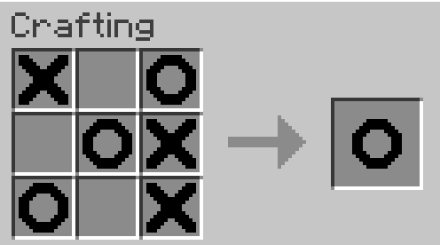
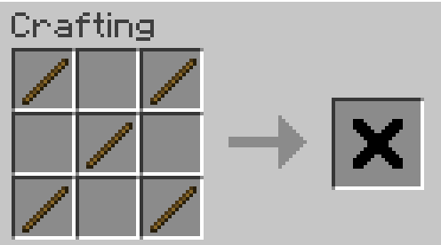
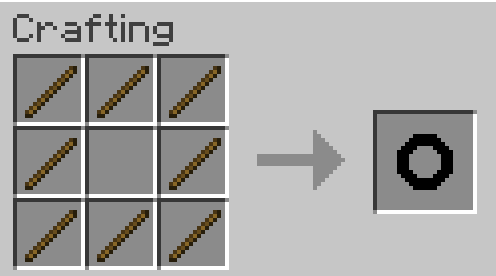

*Tic-Tac-Toe made with only 19,682 recipes. Not cursed at all!*

# Tic-Tac-Cursed

Tic-Tac-Cursed allows you to play Tic-Tac-Toe directly in your crafting table!

## Installation

Simply download the latest version straight from our [Modrinth page](https://modrinth.com/mod/tic-tac-cursed).
It should load on literally any version of Minecraft, using [Quilt](https://quiltmc.org).

## Crafting

You can get crosses and circles by crafting them with sticks:

## Wait.. 19,682 recipes? *Why?*

Because it was a nice way to bother [@LambdAurora](https://modrinth.com/user/LambdAurora). It also coincidentally serves as
a good benchmark for the Quilt resource loader.

If you are curious, yes, there are actually 19.682 JSON recipes. There are located in [`src/main/resources/data/tictaccursed/recipes/generated`](./src/main/resources/data/tictaccursed/recipes/generated)
and generated using [`./gen_recipes.py`](./gen_recipes.py). Yeah, even I don't hate myself enough to do them by hand.

## Can I get a port to X?

Okay, first off, why do you even want a port? What's wrong with you? But also no.

## Should I even be using this mod?

I meaaaaaaaaaaaaan.. you *can* but please don't bother me if your modpack takes too long to load. I warned you.

## How can I contribute?

I, uh, *looks around*. There isn't much to contribute? But if you have a penny to spare, you can contribute to the
[Trevor project](https://www.thetrevorproject.org/) instead!
